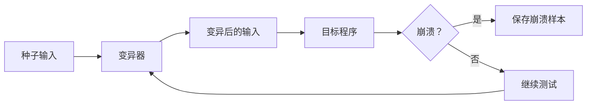
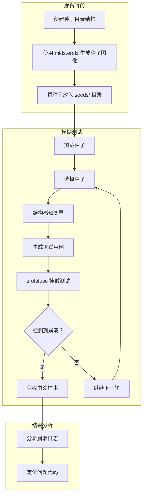
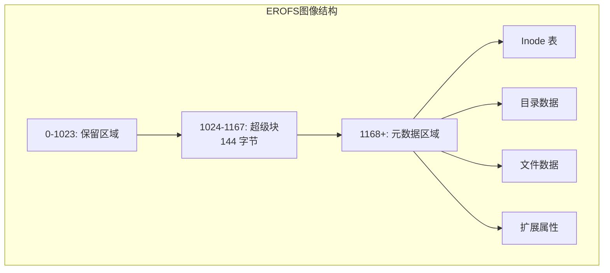
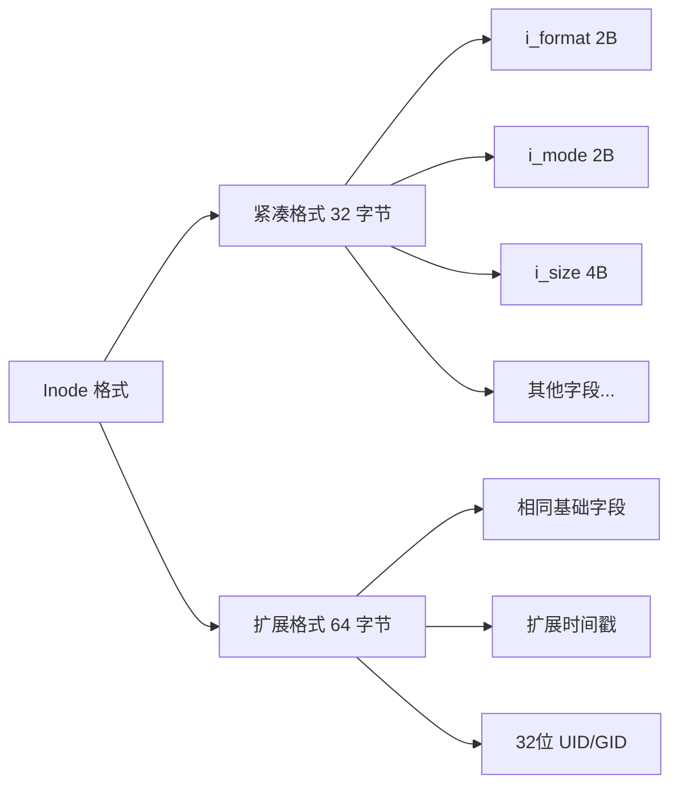
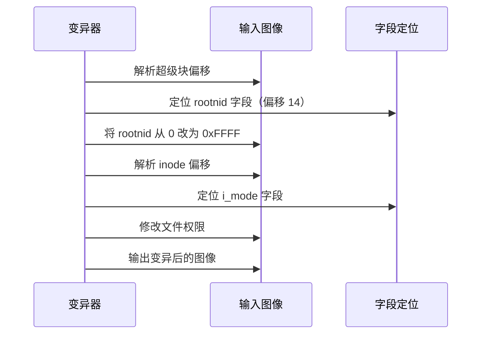
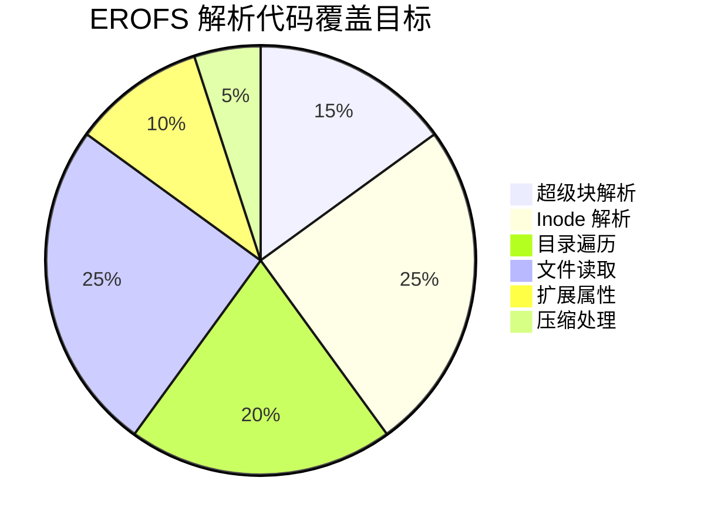

# EROFS 图像模糊测试工具使用指南

> 本指南面向 EROFS 开发者，帮助您理解和使用本模糊测试工具。假设您熟悉 C 语言开发，但对 Rust 和模糊测试概念不太熟悉。

## 目录

1. [什么是模糊测试？](#什么是模糊测试)
2. [工具概述](#工具概述)
3. [核心概念解释](#核心概念解释)
4. [环境准备](#环境准备)
5. [快速开始](#快速开始)
6. [详细使用说明](#详细使用说明)
7. [输出结果解读](#输出结果解读)
8. [高级配置](#高级配置)
9. [常见问题](#常见问题)
10. [技术原理](#技术原理)

---

## 什么是模糊测试？

模糊测试（Fuzzing）是一种自动化软件测试技术，通过向程序输入大量随机或半随机的数据，来发现程序的崩溃、内存泄漏、安全漏洞等问题。



### 为什么 EROFS 需要模糊测试？

EROFS 文件系统涉及复杂的磁盘格式解析：

- **攻击面**：解析恶意构造的 EROFS 图像可能导致内核崩溃或内存损坏
- **边界条件**：特殊值（如极端大小、错误偏移）可能触发未处理的边界情况
- **格式复杂性**：超级块、inode、目录项、扩展属性等多种数据结构

---

## 工具概述

本工具是基于 **LibAFL** 框架开发的 EROFS 图像模糊测试器，主要特点：

| 特性 | 说明 |
|------|------|
| 结构感知变异 | 理解 EROFS 格式，智能修改关键字段而非随机破坏 |
| 多目标支持 | 超级块、inode、目录项、扩展属性等 |
| ASan 集成 | 自动检测内存安全问题 |
| 并行测试 | 支持多进程并行提高效率 |

### 工作流程图



---

## 核心概念解释

### 1. 种子（Seed）

种子是模糊测试的起点——有效的 EROFS 图像文件。好的种子能帮助测试器发现更多问题。

**如何创建种子？**

```bash
# 创建一个简单的目录结构
mkdir -p seed_content/dir1/dir2
echo "Hello, EROFS!" > seed_content/file.txt
echo "测试内容" > seed_content/dir1/中文文件.txt

# 使用 mkfs.erofs 生成 EROFS 图像
mkfs.erofs -E noinline_data seed.erofs seed_content/
```

### 2. 变异（Mutation）

变异是对种子进行修改以产生新测试用例的过程。本工具实现了多种结构感知变异：


### 3. 测试执行器（Executor）

执行器负责运行被测试程序（erofsfuse）并监控其行为：


### 4. 覆盖引导（Coverage-Guided）

覆盖引导模糊测试会追踪哪些代码路径被测试到，优先探索新路径：


---

## 环境准备

### 系统要求

- **操作系统**：Linux（推荐 Ubuntu 20.04+ 或 WSL2）
- **架构**：x86_64 或 ARM64
- **内存**：至少 4GB RAM
- **磁盘**：至少 10GB 可用空间

### 安装步骤

#### 第一步：安装 Rust 工具链

Rust 是本项目的开发语言。您不需要深入学习 Rust，只需安装编译环境。

```bash
# 下载并运行 Rust 安装脚本
curl --proto '=https' --tlsv1.2 -sSf https://sh.rustup.rs | sh

# 按提示选择 1) 继续安装（默认选项）
# 安装完成后，重新加载环境
source $HOME/.cargo/env

# 验证安装
rustc --version
cargo --version
```

#### 第二步：编译带有 ASan 的 erofsfuse

AddressSanitizer (ASan) 是一个内存错误检测工具，能帮助发现：

- 堆缓冲区溢出
- 栈缓冲区溢出
- 释放后使用（use-after-free）
- 双重释放（double-free）

```bash
# 安装编译依赖
sudo apt update
sudo apt install -y build-essential clang llvm libfuse3-dev liblz4-dev libzstd-dev

# 克隆 erofs-utils 源码
git clone https://git.kernel.org/pub/scm/linux/kernel/git/xiang/erofs-utils.git
cd erofs-utils

# 使用 Clang 编译并启用 ASan
# 注意：ASan 需要同时用于编译和链接
CC=clang \
CFLAGS="-fsanitize=address -fno-omit-frame-pointer -g -fcommon" \
LDFLAGS="-fsanitize=address" \
./configure --enable-fuse

# 编译（使用所有 CPU 核心）
make -j$(nproc)

# 编译完成后，erofsfuse 位于 fuse/ 目录
ls -la fuse/erofsfuse
```

**重要提示**：ASan 会显著降低程序速度（约 2-5 倍），但能检测到更多内存问题。

#### 第三步：安装 mkfs.erofs（用于生成种子）

```bash
# 方法一：使用系统包管理器（推荐）
sudo apt install erofs-utils

# 方法二：使用上面编译的版本
# mkfs.erofs 已经包含在 erofs-utils 编译产物中
sudo cp mkfs/erofs.mkfs /usr/local/bin/mkfs.erofs
```

#### 第四步：编译模糊测试器

```bash
# 克隆项目（或使用您已有的源码）
cd /path/to/erofs-image-injector-rs

# 编译发布版本（优化后的二进制）
cargo build --release

# 编译完成后，可执行文件位于
ls -la target/release/erofs-fuzzer
```

**编译时间说明**：首次编译需要下载并编译所有依赖，可能需要 5-15 分钟。

---

## 快速开始

### 第一步：准备种子目录

```bash
# 创建种子存放目录
mkdir -p seeds

# 创建测试内容
mkdir -p test_content/subdir
echo "Hello World" > test_content/file.txt
echo "Nested file" > test_content/subdir/nested.txt
echo "中文测试内容" > test_content/中文.txt

# 生成 EROFS 图像作为种子
mkfs.erofs -E noinline_data seeds/basic.erofs test_content/

# 清理临时目录
rm -rf test_content

# 验证种子
ls -la seeds/
```

### 第二步：创建必要的输出目录

```bash
mkdir -p crashes corpus
```

### 第三步：运行模糊测试

```bash
# 基本用法
./target/release/erofs-fuzzer \
    --seeds ./seeds \
    --output ./crashes \
    --erofsfuse-path ./erofs-utils/fuse/erofsfuse \
    --iterations 10000

# 输出示例：
# [INFO] Initializing EROFS fuzzer...
# [INFO] Loaded 1 seeds
# [INFO] Starting fuzzing loop...
# [INFO] Iterations: 100, Crashes: 0, Corpus: 1
# [INFO] Iterations: 200, Crashes: 0, Corpus: 1
# ...
```

### 第四步：分析崩溃（如果有）

```bash
# 查看崩溃文件
ls -la crashes/

# 示例输出：
# crash-000001a2b3c4d5e6-signal-11.erofs  # 触发崩溃的图像文件
# crash-000001a2b3c4d5e6-signal-11.log    # 崩溃详情

# 查看崩溃日志
cat crashes/crash-000001a2b3c4d5e6-signal-11.log
```

---

## 详细使用说明

### 命令行参数详解


#### 完整参数列表

| 参数 | 简写 | 默认值 | 说明 |
|------|------|--------|------|
| `--seeds` | `-s` | 必需 | 种子 EROFS 图像所在目录 |
| `--output` | `-o` | `./crashes` | 崩溃输出目录 |
| `--corpus` | | `./corpus` | 有趣输入存放目录 |
| `--erofsfuse-path` | | `erofsfuse` | erofsfuse 可执行文件路径 |
| `--timeout` | `-t` | `60` | 每次执行超时时间（秒） |
| `--iterations` | `-i` | `0`（无限） | 最大迭代次数 |
| `--workers` | `-w` | `1` | 并行工作进程数 |
| `--max-size` | | `16777216` (16MB) | 最大图像大小 |
| `--min-size` | | `4096` (4KB) | 最小图像大小 |
| `--mutations-per-input` | | `4` | 每个输入的变异次数 |
| `--log-level` | | `info` | 日志级别 |
| `--verbose` | `-v` | false | 详细输出 |
| `--asan` | | false | 启用 ASan 检测 |
| `--mount-base` | | `/tmp/erofs-fuzz` | 挂载点基础目录 |

### 推荐配置场景

#### 场景一：快速验证（开发调试）

```bash
./target/release/erofs-fuzzer \
    --seeds ./seeds \
    --output ./crashes \
    --erofsfuse-path /path/to/erofsfuse \
    --iterations 1000 \
    --timeout 30 \
    --log-level debug
```

#### 场景二：标准测试（日常使用）

```bash
./target/release/erofs-fuzzer \
    --seeds ./seeds \
    --output ./crashes \
    --erofsfuse-path /path/to/erofsfuse \
    --iterations 100000 \
    --workers 4 \
    --timeout 60
```

#### 场景三：深度测试（CI/CD 或长期测试）

```bash
# 使用 ASan 编译的 erofsfuse
./target/release/erofs-fuzzer \
    --seeds ./seeds \
    --output ./crashes \
    --erofsfuse-path /path/to/asan-erofsfuse \
    --iterations 0 \
    --workers $(nproc) \
    --timeout 120 \
    --asan \
    --log-level warn
```

### 种子管理最佳实践

#### 种子多样性

多样化的种子能发现更多问题：

```bash
# 创建多种类型的种子
mkdir -p seeds

# 1. 最小图像（空目录）
mkdir empty_dir
mkfs.erofs seeds/minimal.erofs empty_dir/
rm -rf empty_dir

# 2. 深层目录结构
mkdir -p deep/a/b/c/d/e/f/g
echo "deep" > deep/a/b/c/d/e/f/g/file.txt
mkfs.erofs seeds/deep.erofs deep/
rm -rf deep

# 3. 大文件
dd if=/dev/urandom of=large_file bs=1M count=10
mkfs.erofs seeds/large.erofs large_file
rm large_file

# 4. 特殊字符文件名
mkdir special
touch "special/空格 文件名.txt"
touch "special/特殊!@#.txt"
mkfs.erofs seeds/special.erofs special/
rm -rf special

# 5. 压缩内容（如果启用压缩支持）
mkdir compressed
echo "AAAAAAAAAAAAAAAA" > compressed/repeat.txt
mkfs.erofs -z lz4hc seeds/compressed.erofs compressed/
rm -rf compressed
```

#### 种子验证

```bash
# 验证种子是否有效
for seed in seeds/*.erofs; do
    echo "Testing $seed..."
    mkdir -p /tmp/erofs_test
    erofsfuse "$seed" /tmp/erofs_test && echo "OK" || echo "FAILED"
    fusermount -u /tmp/erofs_test
    rm -rf /tmp/erofs_test
done
```

---

## 输出结果解读

### 目录结构

```
crashes/
├── crash-000001a2b3c4d5e6-signal-11.erofs    # 触发崩溃的图像
├── crash-000001a2b3c4d5e6-signal-11.log       # 崩溃详情
├── crash-000002b4c5d6e7f8-signal-6.erofs
├── crash-000002b4c5d6e7f8-signal-6.log
└── ...

corpus/
├── erofs_input_abc123...erofs   # 发现新路径的输入
├── erofs_input_def456...erofs
└── ...
```

### 崩溃文件命名规则

```
crash-<时间戳>-signal-<信号号>.erofs
```

常见信号号及其含义：

| 信号 | 名称 | 含义 |
|------|------|------|
| 6 | SIGABRT | 程序主动中止（通常由 assert 或 ASan 触发） |
| 11 | SIGSEGV | 段错误（非法内存访问） |
| 7 | SIGBUS | 总线错误（内存对齐问题） |
| 8 | SIGFPE | 浮点异常（除零等） |

### 崩溃日志内容

```log
Signal: 11
Iteration: 12345
Size: 8192 bytes
```

### 分析崩溃的方法

#### 方法一：直接重现

```bash
# 使用崩溃文件测试
erofsfuse crashes/crash-xxx-signal-11.erofs /tmp/test_mount

# 如果崩溃，可以调试
gdb --args erofsfuse crashes/crash-xxx-signal-11.erofs /tmp/test_mount
```

#### 方法二：使用 ASan 获取详细信息

```bash
# 使用 ASan 版本的 erofsfuse
# ASan 会输出详细的错误信息
ASAN_OPTIONS=symbolize=1 ./erofs-utils-asan/fuse/erofsfuse \
    crashes/crash-xxx-signal-11.erofs /tmp/test_mount
```

ASan 输出示例：
```
=================================================================
==12345==ERROR: AddressSanitizer: heap-buffer-overflow on address 0x6020000001f8
READ of size 4 at 0x6020000001f8 thread T0
    #0 0x7f1234567890 in erofs_read_inode /path/to/erofs-utils/lib/inode.c:123
    #1 0x7f1234567900 in erofs_iget /path/to/erofs-utils/lib/inode.c:456
    ...
```

#### 方法三：最小化崩溃用例

```bash
# 有时崩溃文件较大，可以使用工具简化
# 创建一个简单的最小化脚本
./scripts/minimize_crash.sh crashes/crash-xxx-signal-11.erofs
```

---

## 高级配置

### 并行模糊测试

```bash
# 使用所有 CPU 核心
WORKERS=$(nproc)

./target/release/erofs-fuzzer \
    --seeds ./seeds \
    --output ./crashes \
    --erofsfuse-path /path/to/erofsfuse \
    --workers $WORKERS
```

### 自定义变异策略

项目支持多种变异策略，可以在代码中调整权重：

| 变异器 | 目标 | 说明 |
|--------|------|------|
| ErofsBitflipMutator | 随机位翻转 | 模拟数据损坏 |
| ErofsSuperblockMutator | 超级块 | 修改魔数、块大小、功能标志等 |
| ErofsInodeMutator | Inode | 修改文件模式、大小、UID/GID 等 |
| ErofsDirectoryMutator | 目录项 | 修改文件名、inode 号等 |
| ErofsXattrMutator | 扩展属性 | 修改属性名值对 |

### ASan 环境变量配置

```bash
# 设置 ASan 选项
export ASAN_OPTIONS="symbolize=1:abort_on_error=1:detect_leaks=1"

# 运行模糊测试
./target/release/erofs-fuzzer \
    --seeds ./seeds \
    --erofsfuse-path /path/to/asan-erofsfuse \
    --asan
```

常用 ASan 选项：

| 选项 | 说明 |
|------|------|
| `symbolize=1` | 显示符号化的堆栈跟踪 |
| `abort_on_error=1` | 发现错误时立即中止 |
| `detect_leaks=1` | 启用内存泄漏检测 |
| `detect_stack_use_after_return=1` | 检测返回后使用栈内存 |
| `halt_on_error=0` | 发现错误后继续运行 |

---

## 常见问题

### Q1: 编译时提示找不到 libfuse

```bash
# 安装 FUSE 开发库
sudo apt install libfuse3-dev

# 如果还是不行，尝试
sudo apt install libfuse-dev
```

### Q2: 运行时提示 "erofsfuse not found"

```bash
# 方法一：指定完整路径
./target/release/erofs-fuzzer \
    --erofsfuse-path /full/path/to/erofsfuse \
    --seeds ./seeds

# 方法二：将 erofsfuse 加入 PATH
export PATH=$PATH:/path/to/erofs-utils/fuse
```

### Q3: 挂载失败

```bash
# 检查 FUSE 是否正常工作
fusermount -V

# 检查当前用户是否有 FUSE 权限
ls -la /dev/fuse

# 如果权限不足，将用户加入 fuse 组
sudo usermod -aG fuse $USER
# 注销后重新登录生效
```

### Q4: 内存不足

```bash
# 减小图像大小限制
./target/release/erofs-fuzzer \
    --max-size 4194304 \  # 4MB
    --seeds ./seeds

# 减少并行工作进程数
./target/release/erofs-fuzzer \
    --workers 1 \
    --seeds ./seeds
```

### Q5: 测试速度很慢

```bash
# 如果使用 ASan，这是正常的（速度下降 2-5 倍）
# 可以先用非 ASan 版本快速测试，再用 ASan 版本深入测试

# 减少每次执行的变异次数
./target/release/erofs-fuzzer \
    --mutations-per-input 2 \
    --seeds ./seeds
```

### Q6: 如何查看详细的测试进度？

```bash
# 使用 debug 或 trace 日志级别
./target/release/erofs-fuzzer \
    --log-level debug \
    --seeds ./seeds
```

---

## 技术原理

### EROFS 磁盘格式概述



#### 超级块结构

超级块位于偏移 1024 处，包含文件系统元信息：

| 偏移 | 大小 | 字段 | 说明 |
|------|------|------|------|
| 0 | 4 | magic | 魔数 (0xE0F5E1E2) |
| 4 | 4 | checksum | 校验和 |
| 8 | 4 | feature_compat | 兼容特性标志 |
| 12 | 1 | blkszbits | 块大小位数（12 = 4KB） |
| 13 | 1 | sb_extslots | 扩展槽位数 |
| 14 | 2 | rootnid | 根目录 inode 号 |
| ... | ... | ... | ... |

#### Inode 结构

EROFS 支持两种 inode 格式：



### 变异策略详解

#### 结构感知变异示例



### 测试覆盖率



### 与其他工具的对比

| 特性 | 本工具 | AFL++ | syzkaller |
|------|--------|-------|-----------|
| 结构感知变异 | ✅ | ❌（需要额外配置） | ✅ |
| EROFS 专用 | ✅ | ❌ | ❌ |
| 用户空间测试 | ✅ | ✅ | ❌ |
| ASan 集成 | ✅ | ✅ | ✅ |
| 内核测试 | ❌ | ❌ | ✅ |

---

## 项目结构说明

```
erofs-image-injector-rs/
├── erofs-fuzzer/           # 主程序
│   ├── src/
│   │   ├── main.rs         # 入口点
│   │   ├── cli.rs          # 命令行参数
│   │   ├── executor.rs     # 执行器（运行 erofsfuse）
│   │   └── fuzzer.rs       # 模糊测试主循环
│   └── Cargo.toml
│
├── erofs-format/           # EROFS 格式定义
│   ├── src/
│   │   ├── lib.rs          # 导出和常量
│   │   ├── superblock.rs   # 超级块结构
│   │   ├── inode.rs        # Inode 结构
│   │   ├── directory.rs    # 目录项结构
│   │   └── xattr.rs        # 扩展属性
│   └── Cargo.toml
│
├── erofs-input/            # 输入类型
│   ├── src/
│   │   └── erofs_input.rs  # ErofsImageInput 类型
│   └── Cargo.toml
│
├── erofs-mutator/          # 变异器
│   ├── src/
│   │   ├── lib.rs          # 公共函数
│   │   ├── bitflip_mutator.rs
│   │   ├── superblock_mutator.rs
│   │   ├── inode_mutator.rs
│   │   ├── directory_mutator.rs
│   │   └── xattr_mutator.rs
│   └── Cargo.toml
│
├── erofs-generator/        # 种子生成器
│   ├── src/
│   │   ├── lib.rs
│   │   └── generator.rs    # 图像生成逻辑
│   └── Cargo.toml
│
├── Cargo.toml              # 工作空间配置
├── README.md               # 英文文档
└── USAGE_GUIDE.md          # 本文档
```

---

## 贡献与反馈

如果您在使用过程中发现问题或有改进建议，欢迎：

1. 在项目仓库提交 Issue
2. 提交 Pull Request
3. 联系 EROFS 开发团队

本项目是 GSoC 2026 项目的一部分，感谢 EROFS 社区的支持。

---

## 附录：Rust 快速参考

对于不熟悉 Rust 的开发者，这里提供一些基本概念：

### Cargo 命令

```bash
cargo build          # 编译项目
cargo build --release  # 编译优化版本
cargo run            # 运行项目
cargo test           # 运行测试
cargo doc            # 生成文档
```

### 项目配置文件 (Cargo.toml)

```toml
[package]
name = "erofs-fuzzer"
version = "0.1.0"
edition = "2021"

[dependencies]
libafl = "0.15"        # 模糊测试框架
clap = "4"             # 命令行解析
serde = "1"            # 序列化
tracing = "0.1"        # 日志
```

### 常见 Rust 术语

| 术语 | 对应 C 概念 |
|------|------------|
| `struct` | 结构体 |
| `enum` | 枚举（更强大） |
| `impl` | 实现（方法） |
| `trait` | 类似接口 |
| `Option<T>` | 可空类型 |
| `Result<T, E>` | 返回值或错误 |
| `Vec<T>` | 动态数组 |
| `String` | 字符串 |

---

*文档版本：1.0*
*最后更新：2026-03-25*
